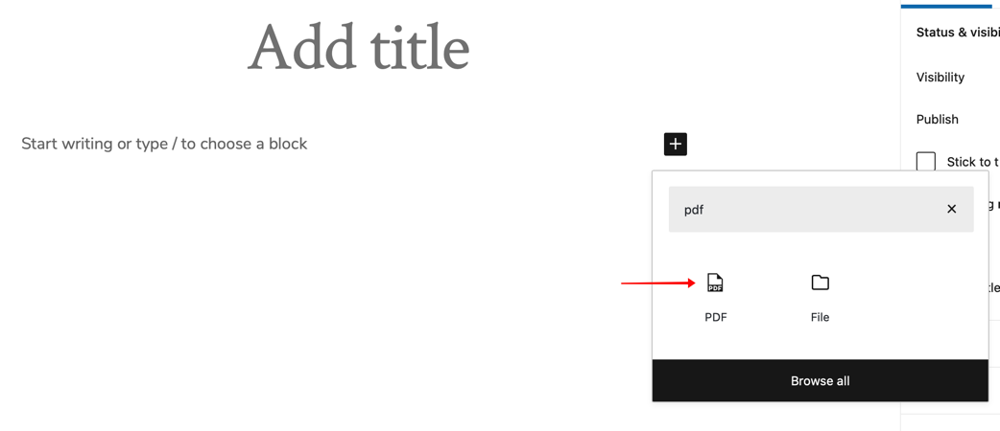
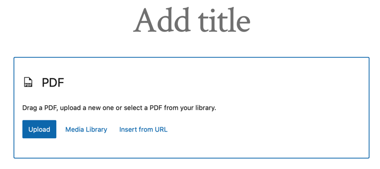
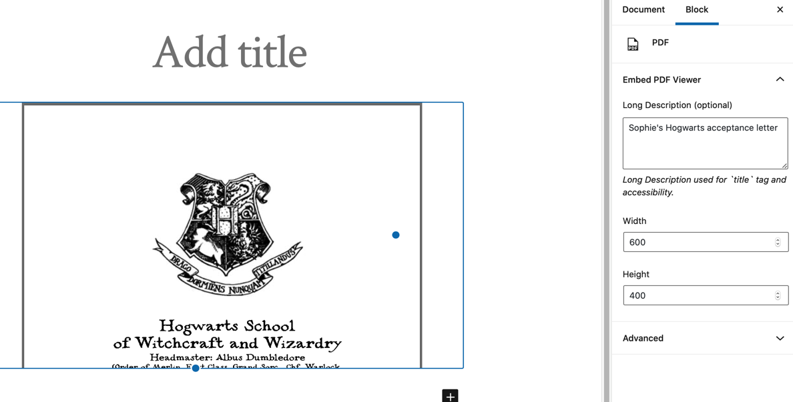

# Embed PDF Viewer

* Contributors: afragen, akirk
* Tags: pdf, embed, oembed, viewer, block
* Requires at least: 4.6
* Requires PHP: 5.6
* Stable tag: master
* License: GPL v2+
* License URI: <https://www.gnu.org/licenses/gpl-2.0.html>

Embed a PDF from the Media Library or elsewhere via oEmbed or as a block into an `object` tag or Google Doc Viewer as fallback.

## Description
Embed a PDF from the Media Library or elsewhere via oEmbed or as a block into an `object` tag or Google Doc Viewer as fallback. The URL only has to be world reachable link.

Inspired by [Embed PDF](https://wordpress.org/plugins/dirtysuds-embed-pdf/) and [RV Embed PDF](https://wordpress.org/plugins/rv-embed-pdf/).

Many thanks to [Alex Kirk](https://github.com/akirk) for making Embed PDF Viewer compatible with the new block editor.

Pull requests are welcome against the `develop` branch.

## Screenshots

Embed PDF Viewer block

Select PDF

PDF block and attributes
